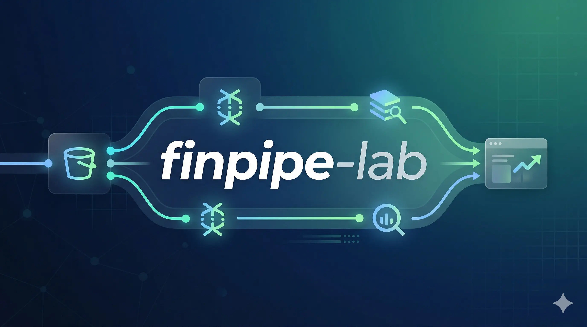

<div align="center">

  

  
  
  
  
  
  
  
  
  
  
  
  
</div>

<br/>

Pipeline orientado a eventos para ingestão, transformação e análise de transações financeiras no GCP.


## 🏗️ Arquitetura

1. **Arquivo CSV depositado** no bucket do GCS com partição Hive
2. **EventArc** detecta o evento de finalização do objeto e invoca a Cloud Run Function
3. **Cloud Run Function** valida o arquivo, gera um audit id único e publica os registros no Pub/Sub
4. **Pub/Sub** persiste o payload JSON na tabela da camada raw via subscription do BigQuery
5. **Cloud Workflows** aguarda a escrita no raw ser concluída, depois executa o silver em paralelo e o gold sequencialmente
6. **Silver** limpa, normaliza e deduplica os registros via MERGE incremental particionado
7. **Gold** enriquece os dados com um join de transações ✕ clientes, particionado e clusterizado para performance de consultas

> Mais detalhes sobre [as escolhas de tecnologia](./docs/por-que-essas-tecnologias.md) e [observações sobre os dados](./docs/observacoes-sobre-os-dados.md).


## ⚙️ Pré-requisitos

- Projeto GCP com faturamento habilitado
- [`gcloud`](https://cloud.google.com/sdk/docs/install) instalado e autenticado


## 🚀 Implantação

Edite o [`config.sh`](./config.sh) com o ID do seu projeto e a região, depois execute cada etapa em ordem:

| # | Componente | Script | O que faz |
|---|-----------|--------|-----------|
| 1 | [Storage](./storage/) | `./storage/deploy.sh` | Cria o bucket de landing no GCS com particionamento Hive |
| 2 | [BigQuery](./bigquery/) | `./bigquery/deploy.sh` | Cria os datasets e as tabelas RAW / Silver / Gold |
| 3 | [Pub/Sub](./pubsub/) | `./pubsub/deploy.sh` | Cria o tópico, a subscription, a DLQ e os alertas por e-mail |
| 4 | [Workflows](./workflows/) | `./workflows/deploy.sh` | Implanta o pipeline de orquestração no Cloud Workflows |
| 5 | [Function](./function/) | `./function/deploy.sh` | Implanta a Cloud Run Function + gatilho EventArc |

> **Atalho:** `./deploy.sh` executa as cinco etapas sequencialmente.


## 🧪 Testes

Com a infraestrutura implantada, o pipeline pode ser acionado depositando os arquivos diretamente no bucket via `gsutil`:

```bash
gsutil cp storage/files/normalized/customers.csv gs://finpipe-landing/entity=customers/year=2026/month=03/day=25/customers.csv
gsutil cp storage/files/normalized/transactions.csv gs://finpipe-landing/entity=transactions/year=2026/month=03/day=25/transactions.csv
```

> Cada upload finalizado dispara automaticamente o EventArc, que invoca a Cloud Run Function e inicia o fluxo.


## 📄 Licença

Este projeto está licenciado sob a [Licença MIT](./LICENSE).

---

<div align="center">
  <sub>Feito com ♥ em Curitiba 🌲 ☔️</sub>
  <br/>
  <sub>Construído com <a href="https://claude.ai/code">Claude Code</a> &nbsp;·&nbsp; mãos de IA, alma humana</sub>
</div>
